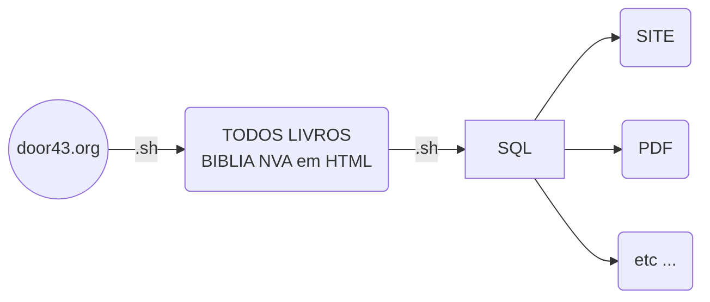

#  Bíblia NVA

Acesse a bíblia NVA toda: https://condiolov.github.io/Biblia-NVA/

Usando script Shell conseguimos baixar a bíblia NVA completa, que esta sob a licença CC BY-SA 4.0 .A ideia desse vídeo é baixar e disponibilizar a bíblia em um site que iremos fazer juntos, e aprender mais sobre programação e um pouco de bíblia. É isso ai valeu!! Estes scripts tem a finalidade de baixar a bíblia NVA no [repositório](https://door43.org/)  em forma de html, depois converter HTML para SQL poderemos então gerar um site ou ate mesmo um PDF da bíblia NVA!! No canal diversalizando no youtube detalho todo os scripts;
Resumo dos processos:

# 1 - Baixando a Biblia NVA
Primeiro procedimento desse script é acessar o repositório da bíblia achar o livro desejado e imprimir, salvar o HTML. Simples assim!!

video 1: https://youtu.be/Tcn5QlcZraE

# 2.1 - Criando SQL da Biblia NVA
Com o HTML baixado numa pasta e podemos trabalhar ele como quisermos, então lemos livro por livro, e quebramos os versos usando uma regex, montamos as querys SQL e ja guardamos o arquivo SQL que esta nessa pasta!! Detalho todo esse script no video a baixo:

video 2: https://youtu.be/v4v1_vevRZQ

# 2.2 - SQL, JSON e CSV da Bíblia
Novas funcionalidade de gerar JSON e CSV alem do sql, mesmo script porem com essas funcionalidades e os arquivos para testes

video : xxxxxx

# 3 - PDF da Biblia NVA
com o SQL no banco de dados converteremos para PDF, com pequenas edições de CSS ja temos uma Biblia NVA em PDF pronta para Download!! Conseguimos baixar a bíblia NVA completa!! Detalho todo esse script no video a baixo:

[DOWNLOAD do PDF da Biblia NVA](https://github.com/Condiolov/Biblia-NVA/tree/master/3%20-%20Gerando%20o%20PDF%20da%20Biblia%20NVA/bibliaNVA.pdf)

agora se tem mais pdfs da biblia em varios formatos!!

video 3: https://youtu.be/OFqlrfqCwRo

# 4 - Bíblia hospedada no github (jQuery e Json, HTML)
Acesse para ver o resultado da biblia nva toda hospedada no github: https://condiolov.github.io/Biblia-NVA/

video 4:

## Em breve

 - [x] 1 - Baixando a Biblia NVA
 - [x] 2.1 - Criando SQL da Biblia NVA
 - [x] 3 - PDF da Biblia NVA
 - [x] 2.2 - SQL, JSON e CSV da Bíblia
 - [x] 4 - Bíblia hospedada no github (jQuery e Json, HTML)
 - [ ]  (Ainda tem muito mais!!)

> **Note:** Inscreve no canal no youtube deixe seu like tem muita coisa legal por la!!

stackedit.io/app
